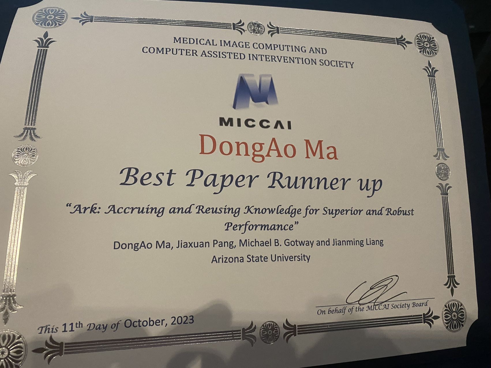

<p align="center"></p>

# Foundation Ark: Accruing and Reusing Knowledge

We develop **open Foundation Models** from numerous public datasets using their heterogeneous expert annotations. Our Ark models outperform SOTA fully/self-supervised methods on various thoracic disease classification tasks and organ/bones segmentation tasks. Ark offers embeddings with superior quality over [Google's CXR Foundation Model](https://github.com/Google-Health/imaging-research/tree/master/cxr-foundation).


## Publication
<b>Foundation Ark: Accruing and Reusing Knowledge for Superior and Robust Performance </b> <br/>
[DongAo Ma](https://www.linkedin.com/in/dongaoma/)<sup>1</sup>, [Jiaxuan Pang](https://www.linkedin.com/in/jiaxuan-pang-b014ab127/)<sup>1</sup>, [Michael B. Gotway](https://www.mayoclinic.org/biographies/gotway-michael-b-m-d/bio-20055566)<sup>2</sup>, [Jianming Liang](https://chs.asu.edu/jianming-liang)<sup>1</sup><br/>
<sup>1 </sup>Arizona State University, <sup>2 </sup>Mayo Clinic <br/>

International Conference on Medical Image Computing and Computer Assisted Intervention ([MICCAI 2023](https://conferences.miccai.org/2023/en/)) (Oral + Poster)

★ [Best Paper Award Runner-up](http://www.miccai.org/about-miccai/awards/best-paper-award-and-young-scientist-award/)

★ [MICCAI 2023 STAR Awards](https://conferences.miccai.org/2023/en/MICCAI-2023-STudent-Author-Registration-(STAR)-Awards.html)

[Paper](https://link.springer.com/chapter/10.1007/978-3-031-43907-0_62) ([PDF](https://rdcu.be/dnwdJ), [Arxiv](https://arxiv.org/abs/2310.09507)) | [Code](https://github.com/jlianglab/Ark) | [Poster](media/Ark_poster.pdf) | Oral Presentation ([YouTube](https://youtu.be/-gq1Zl-mh60), [BiliBili](https://www.bilibili.com/video/BV1ww411Y7Yv/))

<p align="left"></p>

## Poster Presentation [[Youtube](https://www.youtube.com/watch?v=VWlbczuZN7E)] [[BiliBili](https://www.bilibili.com/video/BV14C4y1d7rR/)])
[](https://www.youtube.com/watch?v=VWlbczuZN7E)

## Dataset
1. [CheXpert](https://stanfordmlgroup.github.io/competitions/chexpert/)
2. [ChestX-ray14](https://nihcc.app.box.com/v/ChestXray-NIHCC)
3. [RSNA Pneumonia](https://www.kaggle.com/c/rsna-pneumonia-detection-challenge)
4. [VinDrCXR](https://vindr.ai/datasets/cxr)
5. [Shenzhen](https://lhncbc.nlm.nih.gov/LHC-downloads/downloads.html#tuberculosis-image-data-sets)
6. [MIMIC](https://physionet.org/content/mimic-cxr/2.0.0/)


## Code
### Requirements
+ Python
+ PyTorch ([pytorch.org](http://pytorch.org))
### Setup environment 
Create and activate a Python 3 conda environment:
```
$ conda create -n ark python=3
$ conda activate ark
```
Install PyTorch according to the [CUDA version](https://pytorch.org/get-started/previous-versions/) (e.g., CUDA 11.6)
```
$ conda install pytorch==1.13.1 torchvision==0.14.1 torchaudio==0.13.1 pytorch-cuda=11.6 -c pytorch -c nvidia
```
Clone the repository:
```
$ git clone https://github.com/Mda233/Ark.git
$ cd Ark
$ pip install -r requirements
```

### Setup dataset path
Modify <PATH_TO_DATASET> in [datasets_config.yaml](./datasets_config.yaml) for each dataset.

(To incorporate a new dataset, refer to the examples provided in datasets_config.yaml. Afterwards, create a corresponding dataloader for the dataset in [dataloader.py](./dataloader.py).)

### Train an Ark model
```
# Train Ark-6 with six public datasets
python main_ark.py --data_set MIMIC --data_set CheXpert 
--data_set ChestXray14 --data_set RSNAPneumonia 
--data_set VinDrCXR --data_set Shenzhen 
--opt sgd --warmup-epochs 20  --lr 0.3 
--batch_size 200 --model swin_base --init imagenet  
--pretrain_epochs 200  --test_epoch 10 
--pretrained_weights https://github.com/SwinTransformer/storage/releases/download/v1.0.0/swin_base_patch4_window7_224_22kto1k.pth 
--momentum_teacher 0.9  --projector_features 1376  

```


## Pre-trained Ark models

You can request the pretrained Ark-5 and Ark-6 models (the teacher model) in our paper throught this [Google Form](https://forms.gle/qkoDGXNiKRPTDdCe8) or [wjx.cn](https://www.wjx.cn/vm/OvwfYFx.aspx#).


### Load the model
1. Create Swin Transformer Base model from the [official model](https://github.com/microsoft/Swin-Transformer/blob/main/models/swin_transformer.py) or from [timm (v0.5.4)](https://github.com/huggingface/pytorch-image-models/tree/main#models):
```
model = timm.create_model('swin_base_patch4_window7_224', num_classes=args.num_class, pretrained=False)
```
2. Load the weight:
```
state_dict = torch.load('<PATH_TO_MODEL>/ark6_teacher_ep200_swinb_projector1376_mlp.pth.tar', map_location="cpu")
for k in ['head.weight', 'head.bias', 'head_dist.weight', 'head_dist.bias']:
    if k in state_dict:
        print(f"Removing key {k} from pretrained checkpoint")
        del state_dict[k] 
model.load_state_dict(state_dict, strict=False)
```
### Finetune the model on target tasks
We have integrated Ark pretrained models in our [Benchmark Tansformers GitHub Repository](https://github.com/jlianglab/BenchmarkTransformers)
```
$ git clone https://github.com/jlianglab/BenchmarkTransformers.git
$ cd BenchmarkTransformers
```
```
python main_classification.py --data_set ChestXray14  
--model swin_base 
--init ark 
--pretrained_weights [PATH_TO_MODEL]/ark6_teacher_ep200_swinb_projector1376_mlp.pth.tar 
--data_dir [PATH_TO_DATASET] 
--train_list dataset/Xray14_train_official.txt 
--val_list dataset/Xray14_val_official.txt 
--test_list dataset/Xray14_test_official.txt 
--lr 0.01 --opt sgd --epochs 200 --warmup-epochs 0 --batch_size 64
```

## Citation
If you use this code or use our pre-trained weights for your research, please cite our paper:
```
@InProceedings{ma2023foundation,
    author="Ma, DongAo and Pang, Jiaxuan and Gotway, Michael B. and Liang, Jianming",
    title="Foundation Ark: Accruing and Reusing Knowledge for Superior and Robust Performance",
    booktitle="Medical Image Computing and Computer Assisted Intervention -- MICCAI 2023",
    year="2023",
    publisher="Springer Nature Switzerland",
    address="Cham",
    pages="651--662",
    isbn="978-3-031-43907-0"
}
```

## Acknowledgement
This research has been supported in part by ASU and Mayo Clinic through a Seed Grant and an Innovation Grant, and in part by the NIH under Award Number R01HL128785. The content is solely the responsibility of the authors and does not necessarily represent the official views of the NIH. This work has utilized the GPUs provided in part by the ASU Research Computing and in part by the Bridges-2 at Pittsburgh Supercomputing Center through allocation BCS190015 and the Anvil at Purdue University through allocation MED220025 from the Advanced Cyberinfrastructure Coordination Ecosystem: Services & Support (ACCESS) program, which is supported by National Science Foundation grants #2138259, #2138286, #2138307, #2137603, and #2138296. We also acknowledge Google for granting us access to CXR Foundation API, which enabled us to generate the embeddings for the target datasets. The content of this paper is covered by patents pending.


## License

Released under the [ASU GitHub Project License](./LICENSE).
